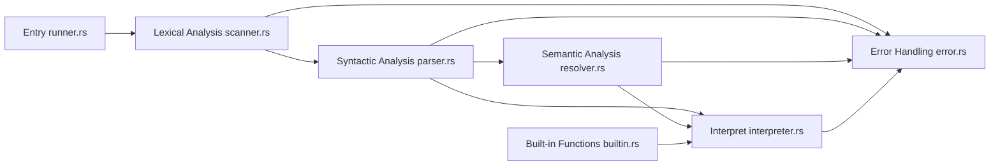
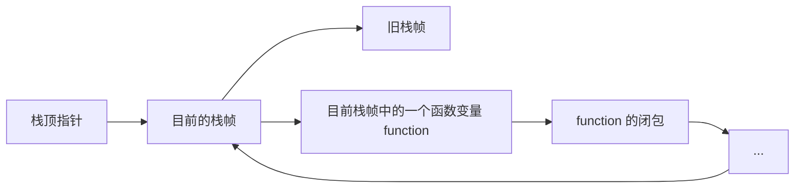

# Rlox 开发文档

| 小组成员姓名 | 学号      | 联系方式                  |
| ------------ | --------- | ------------------------- |
| 金文泽       | 221220028 | wenzejin@smail.nju.edu.cn |

## 1. 项目简述

Rlox 是一个基于 Rust 开发的 Lox 语言解释器，其实现了全部的 Lox 语言特性，并且借助 Rust 高效、安全的特性，保证了质量。Rlox 不仅支持脚本执行，还支持交互式 REPL（Read-Eval-Print Loop）模式，方便用户进行实验和调试。Rlox 的实现参考了 [Crafting Interpreters](http://craftinginterpreters.com/) 一书，参考其中 Tree-Walk Interpreter - Jlox 的实现。Rlox 目前已经在 [GitHub](https://github.com/WenzeJin/rlox) 上开源。

如果需要运行 Rlox，可以前往 [GitHub](https://github.com/WenzeJin/rlox) 获取源代码，并使用以下命令进行编译和运行：

```bash
git clone https://github.com/WenzeJin/rlox.git
cd rlox
cargo build --release   # 编译项目
cargo run   # 运行项目
```

## 2. 项目结构

Rlox 遵循一般地树形解释器的结构与设计，主要分为以下几个部分，以脚本运行的数据流为例：



对于每个模块，大致完成的功能如下：

1. **Lexical Analysis**：输入的 Lox 代码（`String`）被转换为 Token 流（`Vec<Token>`），每个 Token 包含类别、词素、位置等信息。后续的语法分析基于这个 Token 流进行。
2. **Syntactic Analysis**：将 Token 流转换为抽象语法树（AST），并进行语法检查。AST 是一个树形结构，表示代码的语法结构。
   1. 将 Token 流转换为 AST；
   2. 进行语法检查，语法错误一般是缺少某个语法元素，或者有多余的语法元素。一些上下文有关的错误（如变量未定义）会在语义分析阶段检查。
3. **Semantic Analysis**：对 AST 进行语义检查，主要是变量的作用域和类型检查。语义分析不输出结果，但是语义分析会链接一会儿解释时使用的解释器，为解释器写入一些信息，便于后续的解释执行。
   1. 语义分析关心上下文有关的错误，比如变量未定义、在不恰当的地方使用 `return` `this` `super` 等语句，非法继承等。
   2. 语义分析还会进行变量使用与定义的绑定，分析每一个变量的使用是在哪个作用域中定义的，以实现闭包静态作用域，同时还可以提高性能。
4. **Interpretation**：对 AST 进行解释执行，生成最终的运行结果。这一部分还需要实现 Rlox 运行时的各种信息的维护。
5. **Built-in Functions**：实现 Rlox 的内置函数，主要是一些常用的数学函数、字符串函数等。相较于项目基本要求来说，这是一个**额外功能**，实现了多种内置函数，比如 `clock` `input` `parseNumber` 等函数，让 Lox 程序有了与外界交互的能力。
6. **错误处理**：Rlox 在运行的时候可能会出现多种错误，比如词法分析错误、语法分析错误、语义分析错误、运行时错误等。Rlox 采用了 Rust 中常用的错误处理机制，将可能出现错误的函数返回一个 `Result<T, RloxError>`，其中 `T` 是函数的返回值，`RloxError` 是一个枚举类型，表示可能出现的错误。`RloxError` 实现了 `fmt::Display` trait，可以将错误信息打印出来，这使得打印错误的逻辑不必耦合在各个模块中。后续我们将函数的返回值也作为一种“错误”，这样可以更方便地实现 Lox 在任意地方返回结果。

Rlox 的词法分析和语法分析是手工实现的，而非是用了工具如 `antlr4rust` 等工具生成的。

同时，在实现 Rlox 的过程中，还运用了诸如访问者模式等设计来优化代码的可读性和可维护性，并设计了测试程序和用例来验证代码的正确性。

下面，以模块为单位介绍每个模块的设计。

## 3. 各模块设计

### 3.1. 解释器入口

`runner.rs` 是 Rlox 的入口文件，提供了两个主要功能：

1. 运行脚本文件
2. 启动运行 REPL（Read-Eval-Print Loop）

这两个功能共同使用一个 `run` 函数，来运行当前输入的脚本。

### 3.2. 词法分析

`scanner.rs` 是 Rlox 的词法分析器，负责将输入的 Lox 代码转换为 Token 流。其内定义了 `Scanner` 结构体，定义如下：

```rust
pub struct Scanner {
    source: String,
    tokens: Vec<Token>,
    start: usize,
    current: usize,
    line: usize,
    keywords: HashMap<String, TokenType>,
    pub had_error: bool,
}
```

其中 source 是输入的代码， tokens 是生成的 Token 流， start 和 current 分别是当前 Token 的起始位置和结束位置， line 是当前 Token 的行号， keywords 是 Lox 语言的关键字， had_error 是一个布尔值，用于标记是否发生了错误。

从 Rust 的角度来解析一下设计，首先 `Scanner` 中没有任何一个引用类型的字段，意味着其拥有所有字段的所有权。那么我们怎么能最终在调用者的角度获得 Token 流呢？我们可以在 `Scanner` 中定义一个 `scan_tokens` 函数，返回一个 `Vec<Token>`，返回时，使用 `mem::take` 函数来获取 `tokens` 的所有权，避免了不必要的拷贝。这样，我们就可以在 `Scanner` 中使用 `tokens`，而在调用者中也能获得 `tokens` 的所有权。

> [!Note]
> 
> 这启示我们，如果被调用者在语义上倾向于拥有一个对象的所有权，但调用者后续又要使用这个对象时，可以不需要使用引用来妥协，也不需要自己写 unsafe 代码，而是可以看看 Rust 的标准库中是否有类似的函数来帮助我们实现这个目的。比如这里的 `mem::take` 函数，或者 `std::ptr::read` 函数等。这些函数的内部实现虽然也是 unsafe 的，但是它们的 API 是安全的，使用它们就可以避免我们自己写 unsafe 代码了。

词法分析采用的是一个向前看的分析器，最多向前看一个字符（不包括当前字符）。区别于一般的工具生成的基于 DFA 的词法分析器，`Scanner` 使用的是 switch-based 的方法来进行词法分析，因为 Lox 的词法比较简单。大部分的 Token 都是单个字符或者两个字符，可以直接检测并返回，而多字符的 Token 只有三种：字符串、数字和标识符，分别设置一个函数进行解析即可，扫描到不属于这个 Token 的字符便返回到 match 语句中。处理标识符的时候要注意，过滤已有的关键字，并输出关键字 Token，关键字和其对应的 TokenType 定义在了一个 HashMap 中，使用 `String` 作为 key，`TokenType` 作为 value。这样就可以在 O(1) 的时间复杂度内获得关键字对应的 TokenType。

这里要说明的是，Rlox 在基本要求的基础上，利用 `unescape` crate 实现了转义字符的支持，支持了 `\n` `\t` `\"` 等转义字符的解析。

在解析的过程中，Rust 的 `String` 为我们带来了不小的困难，因为 `String` 不支持索引。而如果需要从 `String` 中获得某个 `char` 类型的值的话，如果调用 `chars` 方法，返回的是一个迭代器，而不是一个索引，这就意味着获取某个字符的时间复杂度是 O(n)，而不是 O(1)。如果我们每次都使用同一个迭代器，就可以变成 O(1) 的时间复杂度了，但是又不支持向前看，所以我们需要使用 `peekable` 方法来获得一个迭代器的引用，这样就可以在迭代器中使用 `peek` 方法来向前看了。但是我并没有这么做，鉴于所有字符都是 ASCII 字符，我直接使用了 `as_bytes` 方法来获得一个字节数组的引用，这样就可以使用索引来访问了。这样做的好处是，避免了迭代器的开销，坏处是只能支持 ASCII 字符。

### 3.3. 语法分析

`parser.rs` 是 Rlox 的语法分析器，负责将 Token 流转换为抽象语法树（AST）。

首先，介绍语法分析的输出，也就是 AST 在 Rlox 中的定义。AST 采用 `enum` 的方式来定义，这样就类似 Java 中的 `interface`，可以实现访问者模式，也可以统一地表示任意一个 AST 节点。AST 的定义如下：

```rust
pub enum Expr {
    Binary(Box<Expr>, Token, Box<Expr>),
    Logical(Box<Expr>, Token, Box<Expr>),
    Grouping(Box<Expr>),
    Literal(LiteralValue),
    Unary(Token, Box<Expr>),
    Assign(Token, Box<Expr>),
    Variable(Token),
    Call(Box<Expr>, Vec<Expr>, usize), // (callee, arguments, line)
    Get(Box<Expr>, Token), // (object, name)
    Set(Box<Expr>, Token, Box<Expr>), // (object, name, value)
    This(Token), 
    Super(Token, Token), // (keyword, method)
}

pub enum LiteralValue {
    Number(f64),
    String(String),
    Boolean(bool),
    Nil,
}

pub enum Stmt {
    Var(Token, Option<Expr>),
    Block(Vec<Stmt>),
    Program(Vec<Stmt>),
    Expression(Expr),
    Print(Expr),
    Return(Option<Expr>),
    If(Expr, Box<Stmt>, Option<Box<Stmt>>),
    While(Expr, Box<Stmt>),
    FunctionDecl(Token, Vec<Token>, Rc<Vec<Stmt>>),   // Decl name, params, body. Body uses Rc, because function instance will link to it.
    ClassDecl(Token, Option<Expr>, Vec<Stmt>), // Class name, super class, methods (FuntionDecl)
}
```

以上是 AST 节点的类型定义，接下来，为 AST 定义访问者的 trait，如果要成为一个合法的访问者，必须这些方法：

```rust
// ast/expr.rs
pub trait Visitor<T> {
    fn visit_binary_expr(&mut self, left: &Expr, operator: &Token, right: &Expr) -> T;
    fn visit_logical_expr(&mut self, left: &Expr, operator: &Token, right: &Expr) -> T;
    fn visit_grouping_expr(&mut self, expression: &Expr) -> T;
    fn visit_literal_expr(&mut self, value: &LiteralValue) -> T;
    fn visit_unary_expr(&mut self, operator: &Token, right: &Expr) -> T;
    fn visit_variable_expr(&mut self, name: &Token) -> T;
    fn visit_assign_expr(&mut self, left: &Token, right: &Expr) -> T;
    fn visit_call_expr(&mut self, callee: &Expr, arguments: &[Expr]) -> T;
    fn visit_get_expr(&mut self, object: &Expr, name: &Token) -> T;
    fn visit_set_expr(&mut self, object: &Expr, name: &Token, value: &Expr) -> T;
    fn visit_this_expr(&mut self, name: &Token) -> T;
    fn visit_super_expr(&mut self, keyword: &Token, method: &Token) -> T;
}

// ast/stmt.rs
pub trait Visitor<T> {
    fn visit_program_stmt(&mut self, declarations: &Vec<Stmt>) -> T;
    fn visit_block_stmt(&mut self, declarations: &Vec<Stmt>) -> T;
    fn visit_expression_stmt(&mut self, expression: &Expr) -> T;
    fn visit_print_stmt(&mut self, expression: &Expr) -> T;
    fn visit_var_stmt(&mut self, name: &Token, initializer: &Option<Expr>) -> T;
    fn visit_if_stmt(&mut self, condition: &Expr, then_branch: &Box<Stmt>, else_branch: &Option<Box<Stmt>>) -> T;
    fn visit_while_stmt(&mut self, condition: &Expr, body: &Box<Stmt>) -> T;
    fn visit_function_decl_stmt(&mut self, name: &Token, params: &Vec<Token>, body: &Rc<Vec<Stmt>>) -> T;
    fn visit_return_stmt(&mut self, value: &Option<Expr>) -> T;
    fn visit_class_decl_stmt(&mut self, name: &Token, super_class: &Option<Expr>, methods: &Vec<Stmt>) -> T;
}
```

最后，定义了 `accept` 方法，接受一个访问者，并用 `match` 根据 `self` 的类型来调用访问者的方法，这也是因为 Rust 可以为 `enum` 定义方法的原因。这样就可以实现访问者模式了。

接下来介绍 `Parser` 的实现，`Parser` 的实现是一个递归下降的解析器，使用了 LL(1) 的语法分析方法。`Parser` 的定义如下：

```rust
pub struct Parser {
    tokens: Vec<Token>,
    current: usize,
    pub had_error: bool
```

在实现的过程中，为每一个语法单元定义一个函数，最终返回一个 `Stmt`，代表整个程序。在实现的过程中，还实现了错误恢复，具体做法是，在某一级别的语法单元中，遇到错误时不再继续向上返回错误，而是将错误信息输出，并同步至下一个同步 Token。

具体的实现方式不再赘述。

### 3.4. 语义分析

语义分析是为了检查语法树的语义正确性，主要是变量的作用域和类型检查。语义分析的实现是一个 Vistor，其实现了 `expr::Visitor` `stmt::Visitor` trait。语义分析的实现主要是为了检查变量的作用域和类型检查。下面根据不同的分析类型，简单介绍实现方式。

#### 3.4.1. 变量绑定

为什么要进行变量绑定呢？这是由 Lox 的定义和我们 Interpreter 的实现共同决定的。Lox 的定义中包含拥有闭包的高阶函数，例如

```lox
fun makeCounter() {
    var count = 0;
    fun count() {
        count += 1;
        return count;
    }
    return count;
}
```
在这个例子中，`count` 函数是一个闭包，它引用了外部的 `count` 变量。为了实现这个闭包，我们需要在语义分析阶段进行变量绑定，将 `count` 变量绑定到 `count` 函数中。这样，在执行 `count` 函数时，就可以访问到外部的 `count` 变量了。

在`Interpreter`实现的过程中，我们用一个栈式链表来维护作用域，当定义一个函数时，我们生成一个函数的信息，并将当前的作用域的一个 `Rc` 引用传递给函数信息中的闭包属性。当调用函数时，我们将会在闭包环境的基础上继续创建新的作用域，并执行函数内的代码。这就带来了一个问题：

```lox
var a = 1;
{
    fun printA() {
        print a;
    }
    var a = 2;
}

printA(); // 1
```

上面这段代码，按照 Lox 的静态作用域，`printA` 中的 `a` 始终都应该指的是最外层的 `a`，所以理应输出 `1`。但是根据刚才我们对 `Interpreter` 实现的描述，这里会解释成 `2`，因为它也定义在闭包环境中了。所以我们应该提前静态地绑定好，每个变量到底指哪个作用域中的变量，这样才能保证作用域的正确性。

为了解决这个问题，我们在语义分析阶段，使用一个栈来维护当前的作用域，每个作用域用一个哈希表表示，value 定义为一个布尔值，表示是否被定义，这是为了解决变量边定义边使用的问题，这里不再赘述。并在每次进入一个新的作用域时，将当前的作用域压入栈中。当我们遇到一个变量声明时，我们将其绑定到当前的作用域中，并在后续的语义分析中，检查变量是否被声明，如果变量已经声明，检查其所在作用域到当前作用域的距离，并注册到 `Interpreter` 的 `locals` 中。这样，在解释执行时，我们就可以根据变量的作用域来查找变量了。部分代码如下：

```rust
fn resolve_local(&mut self, name: &token::Token) -> Result<(), RloxError> {
    for (i, scope) in self.scope.iter().rev().enumerate() {
        if scope.contains_key(&name.lexeme) {
            // Variable is defined in this scope
            self.interpreter.resolve(name, i);
            return Ok(());
        }
    }
    // Not found in any scope
    // this is a runtime error as required by the TAs
    // Err(RloxError::RuntimeError(
    //     format!("Undefined variable: '{}'.", name.lexeme)
    // ))
    Ok(())
}
```

在语义分析的过程中，如果遇到未定义的变量，应当是一个语义错误，但是项目要求我们在运行时输出这个错误，所以这里暂时注释掉了。我们在后续的解释执行中会检查这个错误。

变量绑定还可以提高解释器的性能，这一点在后面介绍[运行时](#352-运行时环境)时会提到。

#### 3.4.2. 某些语法的非法使用

某些语法错误是需要上下文进行分析的，不能放在上下文无关的语法分析中，这一部分我们就放在了语义分析中进行检查。比如 `return` 语句只能在函数体内使用，`this` 只能在类的方法中使用，`super` 只能在子类的方法中使用等。我们在语义分析阶段进行检查，并输出错误信息。

我们在 `Resolver` 中维护两个状态，一个是函数状态，一个是类状态，用来指示我们目前访问的语句处于什么语法单元中。比如，如果当前不再一个函数中，我们就不能使用 `return` 语句。如果当前不在一个类中，我们就不能使用 `this` 语句。我们在语义分析阶段进行检查，并输出错误信息。

```rust
enum FunctionType {
    None,
    Function,
    Method,
    Initializer
}

enum ClassType {
    None,       // 不能使用 this 和 super
    Class,      // 可以使用 this
    SubClass,   // 可以使用 super 和 this
}
```

### 3.5. 解释器

这就是 Rlox 的重头戏了，解释器的实现。解释器的实现是一个访问者模式的实现，使用了 `Visitor` trait 来实现访问者模式。解释器的实现主要是对 AST 进行解释执行，生成最终的运行结果。首先，我们先来看看 Rlox 是怎么维护 Lox 运行时的各类数据和状态的。

#### 3.5.1. 运行时数据结构

首先，来看看 Rlox 是如何表示 Lox 中的各种值的：

```rust
pub enum LoxValue {
    Number(f64),
    Class(Rc<RefCell<LoxClass>>),
    String(String),
    Boolean(bool),
    Callable(LoxFunction),
    Instance(Rc<RefCell<LoxInstance>>),
    Null,
}
```

`LoxValue` 是一个枚举类型，表示 Lox 中的各种值。它包含了数字、字符串、布尔值、函数、类、实例等类型。我们在解释器中使用 `LoxValue` 来表示 Lox 中的各种值。这里面某些类型比较显然，主要介绍一些比较复杂的类型。

##### Callable

`Callable` 表示 Lox 中的函数类型，其中包含一个 `LoxFunction` 类型的值，表示函数的具体实现。`LoxFunction` 的定义如下：

```rust
pub enum LoxFunction {
    BuiltInFunction(u32, fn(Vec<LoxValue>) -> Result<LoxValue, RloxError>),     // (Arity, Function)
    UserFunction {
        def_name: String,
        params: Vec<String>,
        body: Rc<Vec<Stmt>>,
        closure: Rc<RefCell<EnvItem>>,  // Environment of this function
        is_initializer: bool,
    },
}
```

`LoxFunction` 是一个枚举类型，表示 Lox 中的函数类型。它包含了内置函数和用户定义函数两种类型。内置函数是 Rust 中实现的函数，用户定义函数是 Lox 中定义的函数。内置函数的参数是一个 `u32` 类型的值，表示函数的参数个数，和一个 `fn` 类型的值，表示函数的具体实现。如果要实现一个内置函数，实际上就是要实现一个输入为 `Vec<LoxValue>` 输出为 `Result<LoxValue, RloxError>` 的函数，我们在 [3.6 内置函数](#36-内置函数) 中会介绍如何实现一个内置函数并注册到运行时环境中。

用户函数则是在解释器的解释过程中动态生成的，其包含函数的名称、参数名字、函数体、闭包环境等信息，还包含一个标记，表示该函数是否是一个初始化函数，待会儿在说明类的实现时会说明这一点。初始化函数是类中的构造函数，和普通函数的区别在于，初始化函数会返回一个实例对象，而普通函数则不会。这里某些属性是用了 `Rc` 和 `RefCell` 来实现的，因为其他地方可能也需要引用这个函数的信息，而 `Rc` 和 `RefCell` 可以实现多重引用和可变引用。`Rc` 是一个引用计数的智能指针，表示一个值的所有权可以被多个变量共享。`RefCell` 是一个可变借用的智能指针，表示一个值可以被多个变量共享，但只能有一个变量可以修改它。

函数调用时的行为，在下面再介绍。

##### Class

`Class` 表示 Lox 中的类的类型描述，包含了类的名称、父类、方法等信息。这里同样是用了 `Rc` 和 `RefCell` 来实现的，因为类的信息可能会被多个变量共享。一个类的名字需要绑定到这个类，一个类的实例、子类同样需要引用这个类，这也是我们使用引用计数的原因。

```rust
pub struct LoxClass {
    pub name: String,
    pub super_class: Option<Rc<RefCell<LoxClass>>>,
    pub methods: HashMap<String, LoxFunction>,
}
```

可以看到 Rlox 保存了一个类的名字、父类和方法。方法是一个哈希表，key 是方法的名字，value 是方法的实现。这里的方法是一个 `LoxFunction` 类型的值，表示方法的具体实现。我们在解释器中使用 `LoxClass` 来表示 Lox 中的类。

##### Instance

`Instance` 表示 Lox 中的实例对象，包含了实例对象的类和属性等信息。 其核心是用一个哈希表来保存实例对象的各个属性。

```rust
pub struct LoxInstance {
    pub class: Rc<RefCell<LoxClass>>,
    fields: HashMap<String, LoxValue>,
}
```

`LoxInstance` 是一个结构体，表示 Lox 中的实例对象。它包含了类和属性等信息。类是一个 `Rc<RefCell<LoxClass>>` 类型的值，表示实例对象的类。属性是一个哈希表，key 是属性的名字，value 是属性的值。

以上就是 Rlox 中的运行时 Lox 变量与各种数据的表示方式，接下来介绍 Rlox 中运行时环境的组织。

#### 3.5.2. 运行时环境

`env.rs` 是 Rlox 的运行时环境，负责维护 Lox 运行时的各种数据和状态。Rlox 中的运行时环境是一个栈式链表，每个节点表示一个作用域。每个节点包含一个哈希表，表示当前作用域中的变量。每个节点还包含一个指向上一个节点的指针，表示当前作用域的父作用域。

`Environment` 是 Rlox 中的运行时环境的结构体，其向外提供多个接口，但又不希望外部直接访问其内部的哈希表，来维护封装性。其提供的结构包括但不限于 定义一个变量、获取一个变量、设置一个变量，同时，由于前面我们提到我们已经实现绑定好绝大部分变量，所以还提供了根据层数直接跳转到某个作用域的获取、设置。这样就可以实现正确地变量访问，同时还提高了运行时的性能。还提供进入新作用域、退出作用域的方法。`Environment` 的定义如下：

```rust
pub struct Environment {
    pub call_stack: usize,
    pub values: Rc<RefCell<EnvItem>>,
    pub global: Rc<RefCell<EnvItem>>,
}

static MAX_CALL_STACK: usize = 255;

impl Environment {
    pub fn new() -> Self {
        let global = Rc::new(RefCell::new(
            EnvItem {
                table: HashMap::new(),
                parent: None,
            }
        ));
        Environment {
            call_stack: 0,
            global: Rc::clone(&global),
            values: Rc::clone(&global),
        }
    }

    pub fn from(call_stack: usize, global: Rc<RefCell<EnvItem>>, closure: Rc<RefCell<EnvItem>>) -> Result<Self, RloxError> {
        if call_stack > MAX_CALL_STACK {
            Err(RloxError::RuntimeError("Stack overflow.".to_string()))
        } else {
            Ok(Environment {
            call_stack: call_stack,
            global: Rc::clone(&global),
            values: Rc::clone(&closure),
        })
        }
    }
}
```

`Environment` 除了可以创建一个全新的环境外，还可以从一个已有的环境中创建一个新的环境，指定 `global` 和 `closure`。这样就可以实现闭包的环境了。同时此时还要检查是否达到了最大调用栈的限制，避免出现栈溢出的问题，如果出现栈溢出，及时地返回错误。

`EnvItem` 是 Rlox 中的运行时环境的节点，表示一个作用域。它包含了一个哈希表，表示当前作用域中的变量。它还包含了一个指向上一个节点的指针，表示当前作用域的父作用域。为什么指针是 `Rc` 而不是 `Box` 呢？因为前面提到，函数中的闭包属性可能也要引用到这个作用域的信息，所以我们需要使用 `Rc` 来实现多重引用。`EnvItem` 的定义如下：

```rust
pub struct EnvItem {
    pub table: HashMap<String, LoxValue>,
    pub parent: Option<Rc<RefCell<EnvItem>>>,
}
```

以上就是 Rlox 中的运行时环境的组织方式，接下来介绍 Rlox 中的解释器的实现。

#### 3.5.3. 解释器实现

前面提到，解释器的实现是一个访问者模式的实现，使用了 `Visitor` trait 来实现访问者模式。解释器的实现主要是对 AST 进行解释执行，生成最终的运行结果。解释器的实现主要是对 AST 进行遍历，并根据 AST 的类型来执行相应的操作。大部分节点的访问比较简单，只需要做对应的操作就可以了，比如访问一个二元表达式，只需要计算左操作数和右操作数，然后根据操作符来执行相应的操作就可以了。这里用有限的篇幅，介绍比较复杂的一些结构的解释器实现：函数和面向对象的实现。

##### 函数

函数是 Lox 中的一个重要概念，函数可以是内置函数，也可以是用户定义函数。内置函数是在 Rust 中实现的函数，用户定义函数是在 Lox 中定义的函数。内置函数的参数是一个 `u32` 类型的值，表示函数的参数个数，和一个 `fn` 类型的值，表示函数的具体实现。用户定义函数则是在解释器的解释过程中动态生成的，其包含函数的名称、参数名字、函数体、闭包环境等信息。

首先介绍函数定义的实现。函数定义后，直接就保存在当前环境作用域中，即函数是一等公民，函数和变量是一样的，可以作为参数，也可以复制给变量。这从我们此前将函数作为 `LoxValue` 的一个变体就可以看出来了。对于内置函数，我们一开始就将其注册到 `Global` 作用域。对于用户函数，当我们遍历到函数定义时：

```rust
fn visit_function_decl_stmt(&mut self, name: &Token, params: &Vec<Token>, body: &Rc<Vec<stmt::Stmt>>) -> Result<(), RloxError> {
    // resolve function name
    let name = name.lexeme.clone();
    // resolve names of parameters
    let params: Vec<String> = params.iter().map(|param| param.lexeme.clone()).collect();
    // create a new function
    let function = LoxValue::Callable(LoxFunction::UserFunction{
        def_name: name.clone(),
        params,
        body: Rc::clone(body),
        closure: Rc::clone(&self.env.values),
        is_initializer: false,
    });
    // define the function in the current environment
    self.env.define(&name, function);
    Ok(())
}
```

在这里，我们首先解析函数的名称和参数名称，然后创建一个新的函数，并将其定义在当前环境中。这里需要注意的是，函数的闭包环境是当前环境的引用，而不是当前环境的拷贝，这样就可以实现闭包了。

接下来是比较复杂的函数调用，Rlox 为 `LoxFunction` 定义了一个 `invoke` 方法，用来调用函数，这个函数接受当前解释器 `Interpreter` 的引用、函数的参数，首先检查参数个数是否匹配，如果不匹配，返回错误。然后根据函数的类型，分别处理内置函数和用户定义函数。内置函数直接调用 Rust 中实现的函数，用户定义函数则需要创建一个新的环境，并将参数绑定到新的环境中。然后执行函数体，最后返回结果。当我们访问到调用的语法结构时：

```rust
fn visit_call_expr(&mut self, callee: &expr::Expr, arguments: &[expr::Expr]) -> Result<LoxValue, RloxError> {
        let callee_value = callee.accept(self)?;
        if let LoxValue::Callable(method) = callee_value {
            let mut arg_values = Vec::new();
            for arg in arguments {
                arg_values.push(arg.accept(self)?);
            }
            if arg_values.len() != method.arity() as usize {
                return Err(RloxError::RuntimeError(format!("Expected {} arguments but got {}.", method.arity(), arg_values.len())));
            }
            method.invoke(self, arg_values)
        } else if let LoxValue::Class(class) = callee_value {
            // class 初始化，下面会介绍，这里省略
        } else {
            Err(RloxError::RuntimeError("Can only call functions and classes.".to_string()))
        }
    }
```

首先区分调用的值是一个函数还是一个类定义，如果是一个函数，则调用 `invoke` 方法来调用函数。如果是一个类定义，则需要创建一个新的实例，并将参数绑定到新的实例中，之后在面向对象的部分会提到。这里的 `invoke` 方法就是我们前面提到的函数调用的方法。

内置函数的调用非常简单：

```rust
LoxFunction::BuiltInFunction(_, implementation) => {
    // invoke built-in function
    implementation(arguments)
},
```

用户定义函数的调用稍微复杂一些：

```rust
LoxFunction::UserFunction{ params, body, closure, is_initializer, .. } => {
    // create a new environment for the function call
    let global = interpreter.env.global.clone();
    let closure = closure.clone();
    let old_call_stack = interpreter.env.call_stack;
    let env = Environment::from(old_call_stack + 1, global, closure)?;
    
    let old_env = interpreter.change_env(env);
    // enter a new scope
    interpreter.env.enter_scope();
    // bind parameters to arguments
    for (param, arg) in params.iter().zip(arguments.iter()) {
        interpreter.env.define(param, arg.clone());
    }
    // evaluate the function body
    let result = interpreter.execute_block(body);
    // exit the scope
    interpreter.env.exit_scope();
    let closure = interpreter.change_env(old_env);
    // return the result
    // if the result is a return statement, return the value
    match result {
        Ok(_) => {
            if *is_initializer {
                // if the function is an initializer, always return this
                let this_token = Token::new(TokenType::This, "this".to_string(), 0);
                let this = closure.get_by_depth(&this_token, 0).unwrap();
                Ok(this)
            } else {
                Ok(LoxValue::Null)
            }
        },
        Err(RloxError::ReturnValue(value)) => {
            // return the value
            if *is_initializer {
                // if the function is an initializer, always return this
                let this_token = Token::new(TokenType::This, "this".to_string(), 0);
                let this = closure.get_by_depth(&this_token, 0).unwrap();
                Ok(this)
            } else {
                Ok(value)
            }
        },
        Err(e) => {
            // return the error
            Err(e)
        }
    }
},
```

可以看到在调用的过程中，先用闭包创建一个新的环境，再调用 `interpreter` 的 `change_env` 方法来切换到新的环境中。然后在新的环境中绑定参数和参数值，执行函数体，最后返回结果。这里需要注意的是，我们在执行函数体时，使用了 `execute_block` 方法，这个方法会在执行完函数体后，自动退出作用域。

由于我们将返回值也作为一种错误来实现，所以我们在调用函数时，返回值是一个 `Result` 类型的值，如果函数执行成功，返回 `Ok(LoxValue::Null)`，如果函数执行失败，返回 `Err(RloxError::ReturnValue(value))`。这样就可以实现函数的返回值了。同时我们要区分一个函数是否是初始化函数，Lox 中，初始化函数始终返回`this`，而不是 `null` 或者其他的东西。

> [!Caution]
>
> 实现函数调用时，必须严格遵守和语义分析时相同的作用域创建规则，否则会导致此前我们绑定好的变量是错误的。

##### 面向对象

Lox 是一门面向对象的语言，支持类和实例的概念。Rlox 中的类和实例的实现是基于 Rust 的结构体来实现的，前面我们已经提到了其数据结构。接下来看看在 Rlox 中如何实现类和实例。

首先是类的定义，在 Lox 语法中，类的定义包含类名、继承信息以及方法定义：

```rust
fn visit_class_decl_stmt(&mut self, name: &Token, maybe_super_class: &Option<expr::Expr>, methods: &Vec<stmt::Stmt>) -> Result<(), RloxError> {
    let class_name = name.lexeme.clone();
    self.env.define(&class_name, LoxValue::Null);

    let mut class = LoxClass::new(class_name.clone());

    // set super class
    if let Some(super_class) = maybe_super_class {
        if let LoxValue::Class(super_class) = super_class.accept(self)? {
            class.super_class = Some(Rc::clone(&super_class));
            // define super
            self.env.enter_scope();
            self.env.define("super", LoxValue::Class(Rc::clone(&super_class)));
        } else {
            return Err(RloxError::SemanticError("Superclass must be a class".to_string()));
        }
    }

    for method in methods {
        if let stmt::Stmt::FunctionDecl(name, params, body) = method {
            let method_name = name.lexeme.clone();
            let function = LoxFunction::UserFunction{
                def_name: method_name.clone(),
                params: params.iter().map(|param| param.lexeme.clone()).collect(),
                body: Rc::clone(body),
                closure: Rc::clone(&self.env.values),
                is_initializer: method_name == "init",
            };
            // eprintln!("clousure: {:?}", Rc::clone(&self.env.values));
            class.methods.insert(method_name.clone(), function);
        }

    }

    if let Some(_super_class) = maybe_super_class {
        self.env.exit_scope();
    }

    self.env.assign(name, LoxValue::Class(Rc::new(RefCell::new(class))))?;


    Ok(())
}
```

在这个访问函数里，我们首先解析类的名称，然后创建一个新的类，并将其定义在当前环境中。接下来，我们检查是否有父类，如果有父类，则将父类绑定到当前环境中，并将父类的信息保存到类中。然后，我们遍历方法定义，将方法绑定到类中。最后，我们将类定义在当前环境中。

当解释器访问调用时，如果发现被调用的值是一个类的定义，就会创建这个类的实例，并且用`init`方法初始化这个实例：

```rust
fn visit_call_expr(&mut self, callee: &expr::Expr, arguments: &[expr::Expr]) -> Result<LoxValue, RloxError> {
    let callee_value = callee.accept(self)?;
    if let LoxValue::Callable(method) = callee_value {
        // 前面已经提到过的函数调用
    } else if let LoxValue::Class(class) = callee_value {
        let instance = LoxInstance::new(&class);
        let class = instance.class.clone();
        // 调用 init 方法
        let initializer = class.borrow().find_method("init");
        let instance_rc = Rc::new(RefCell::new(instance));
        if let Some(initializer) = initializer {
            let mut arg_values = Vec::new();
            for arg in arguments {
                arg_values.push(arg.accept(self)?);
            }
            if arg_values.len() != initializer.arity() as usize {
                return Err(RloxError::RuntimeError(format!("Expected {} arguments but got {}.", initializer.arity(), arg_values.len())));
            }
            
            initializer.bind(Rc::clone(&instance_rc)).invoke(self, arg_values)?;
        }

        Ok(LoxValue::Instance(Rc::clone(&instance_rc)))
    } else {
        Err(RloxError::RuntimeError("Can only call functions and classes.".to_string()))
    }
}
```

实例生成的时候，我们立即将这个实例变为一个 `Rc` 引用，这实际上也和 Lox 的语义非常相符：变量保存的是实际对象的引用，而不是对象的值。这样就可以实现类的实例化了。
在实例化的时候，我们会调用 `init` 方法来初始化实例，这个方法实际上就是类的构造函数。我们在访问 `init` 方法时，会将实例绑定到 `this` 上，这样就可以在 `init` 方法中访问实例的属性了。

接下来看类的属性和方法的访问，类的属性和方法的访问是通过 `get` 和 `set` 来实现的。我们在访问类的属性和方法时，会先检查属性和方法是否存在，如果存在，则返回属性和方法的值。如果不存在，则返回错误。

```rust
fn visit_get_expr(&mut self, object: &expr::Expr, name: &Token) -> Result<LoxValue, RloxError> {
    let object_value = object.accept(self)?;
    if let LoxValue::Instance(instance) = object_value {
        instance.borrow().get(&name.lexeme, &instance)
    } else {
        Err(RloxError::RuntimeError("Only instances have properties.".to_string()))
    }
}
```

在访问属性时，我们会先检查对象是否是一个实例，如果是，则调用实例的 `get` 方法来获取属性的值。`get` 方法会先检查属性是否存在，如果存在，则返回属性的值。如果不存在，则返回错误。

```rust
pub fn get(&self, name: &str, instance: &Rc<RefCell<LoxInstance>>) -> Result<LoxValue, RloxError> {
    if let Some(value) = self.fields.get(name) {
        return Ok(value.clone())
    } 

    if let Some(method) = self.class.borrow().find_method(name) {
        return Ok(LoxValue::Callable(method.bind(Rc::clone(instance))));
    }

    Err(RloxError::RuntimeError( format!("Undefined property '{}'.", name) ))
}
```

在调用对象的`get`时，会先检查是否是一个属性，如果是一个属性，就返回属性的值；再检查是否是一个方法，如果是一个方法，那么就构造一个绑定了`this`的方法并返回；如果都不是，则返回错误。

这里我们在获得方法时，直接将`this`绑定到方法上，形成一个新的闭包，这样就可以在方法中访问实例的属性了。


在获得方法时，是询问类的定义来获取方法的，当一个类没有定义这个方法时，我们会向父类询问这个方法，如果父类也没有定义这个方法，则返回错误。这实际上就是 Lox 的继承机制了。

到这里我们还没有说明 Rlox 中是如何使用 super 的，实际上，super 跟 this 一样，也是作为一个标识符存储在作用域中，但是以上代码中只看到了准备 `this` 并没有看到 `super`。这是因为 `super` 的准备实际发生在类的定义时，我们在进入类的定义时，如果有父类，就新建一个作用域，并将 `super` 定义在这个作用域中。这样在所有方法定义时，其引用的闭包实际上就是从这个super作用域开始的。可以通过 以下两个实际的例子来说明。

首先是一个没有继承的类：

```lox
// scope global
class A {
    fun printA() {
        print "A";
    }
}
```


然后是一个有继承的类：

```lox
// scope global
class A < Another {
    fun printA() {
        print "A";
    }
}
```


以上就是 Rlox 中的面向对象的实现，Rlox 中的类和实例的实现是基于 Rust 的结构体来实现的，类和实例的访问是通过 `get` 和 `set` 来实现的。类和实例的继承是通过复用方法实现的。`this` 和 `super` 分别是动态绑定实例和定义时绑定父类实现的。

### 3.6. 内置函数

> [!Note]
>
> 内置函数的实现是一个额外的功能，并不在项目的要求中。

前面我们提到可以为 Lox 提供内置函数，下面说明如何实现内置函数。内置函数实现在 `builtin.rs`中，要实现一个内置函数，只需要实现一个输入为 `Vec<LoxValue>` 输出为 `Result<LoxValue, RloxError>` 的函数，并将其注册到 `Global` 作用域中即可。内置函数的注册是在 `regist_builtin` 函数中完成的，`regist_builtin` 函数会在解释器初始化时调用。下面是注册用的宏:

```rust
macro_rules! init_builtin {
    ($env:expr, $name:expr, $arity:expr, $impl:expr) => {
        $env.define_globally($name, LoxValue::Callable(LoxFunction::BuiltInFunction($arity, $impl)));
    };
}
```

目前定义了三个内置函数，分别是 `clock` `print` `parseNum`，分别用于获取当前时间、打印输出和解析数字。下面是他们的实现，也可以从实现中看出应该如何实现一个 Rlox 内置函数：

```rust
fn clock_impl(_args: Vec<LoxValue>) -> Result<LoxValue, RloxError> {
    use std::time::{SystemTime, UNIX_EPOCH};
    let now = SystemTime::now();
    match now.duration_since(UNIX_EPOCH) {
        Ok(duration) => {
            let seconds = duration.as_secs() as f64;
            Ok(LoxValue::Number(seconds))
        }
        Err(_) => Err(RloxError::RuntimeError("clock(): Failed to get clock".to_string())),
    }
}

fn input_impl(_args: Vec<LoxValue>) -> Result<LoxValue, RloxError> {
    use std::io;
    let mut input = String::new();
    io::stdin().read_line(&mut input).unwrap();
    Ok(LoxValue::String(input.trim().to_string()))
}

fn parse_number_impl(args: Vec<LoxValue>) -> Result<LoxValue, RloxError> {
    if args.len() != 1 {
        return Err(RloxError::RuntimeError("parseNumber(): Need exactly 1 argument".to_string()));
    }
    match &args[0] {
        LoxValue::String(s) => {
            match s.parse::<f64>() {
                Ok(n) => Ok(LoxValue::Number(n)),
                Err(_) => Err(RloxError::RuntimeError("parseNumber(): Invalid number format".to_string())),
            }
        }
        _ => Err(RloxError::RuntimeError("parseNumber(): Need a string argument".to_string())),
    }
}
```

最后，看看 Rlox 中如何简洁地注册这三个内置函数：

```rust
pub fn regist_builtins(env: &mut Environment) {
    init_builtin!(env, "clock", 0, clock_impl);
    init_builtin!(env, "input", 0, input_impl);
    init_builtin!(env, "parseNumber", 1, parse_number_impl);
}
```

## 4. 测试

本项目有良好的测试覆盖率，使用 `cargo test` 可以运行所有的测试用例。我们在项目中使用了 `rstest` 和 `rstest_reuse` 来实现测试用例的复用和参数化测试。我们在 `testcases` 目录下存放了所有的测试用例，主要分为以下几类：

- `statements`：测试表达式
- `control_flows`：测试控制流语句
- `function`：测试函数
- `class`：测试类
- `oj_pub`：测试 OJ 公开测试用例

同时，设计了测试程序，自动化地使用测试用例进行测试

- `test_interpret_simple.rs`：测试解释器的简单测试用例
- `test_parse.rs`：测试语法分析器的简单测试用例
- `test_interpret.rs`：测试解释器的复杂测试用例，这部分就是直接使用 `testcases` 目录下的测试用例进行测试

部分测试中，是用了 `rstest` 进行参数化测试，类似下面：

```rust
#[rstest]
#[case("1 + 2 * 3;", "[(+ 1 (* 2 3))]")]
#[case("1 + 2 * 3 - 4 / 5;", "[(- (+ 1 (* 2 3)) (/ 4 5))]")]
#[case("-1 + 2;", "[(+ (- 1) 2)]")]
#[case("1 != 3 + 4;", "[(!= 1 (+ 3 4))]")]
#[case("\"hello\" + \"world\";", "[(+ hello world)]")]
#[case("-1 + 2 * 3 == 4 / 5 == true == false != nil;", "[(!= (== (== (== (+ (- 1) (* 2 3)) (/ 4 5)) true) false) nil)]")]
#[case("var a; a = 1 + 2 + b * (c = d);", "[(var a);(= a (+ (+ 1 2) (* b (group (= c d)))))]")]
#[case::assignment_right_associative("a = b = c = d;", "[(= a (= b (= c d)))]")]
#[case("true and false;", "[(and true false)]")]
#[case("true or false;", "[(or true false)]")]
#[case("true and false or true;", "[(or (and true false) true)]")]
#[case("a or b and c;", "[(or a (and b c))]")]
#[case("a and b or c and d;", "[(or (and a b) (and c d))]")]
#[case("a and (b or c);", "[(and a (group (or b c)))]")]
#[case("(a or b) and c;", "[(and (group (or a b)) c)]")]
#[case("a or b and c or d;", "[(or (or a (and b c)) d)]")]
#[case("a and !b;", "[(and a (! b))]")]
fn test_expr_stmt(#[case] source: &str, #[case] expected: &str) {
    let mut scanner = Scanner::new(source.to_string());
    let tokens = scanner.scan_tokens();
    let mut parser = Parser::new(tokens);
    let statement = parser.parse().unwrap(); // 表达式语句视为 statement
    let mut printer = pretty_printer::AstPrinter();
    assert_eq!(statement.accept(&mut printer), expected);
}
```

这里就感觉到 rust 测试很不方便，官方或者社区并没有非常方便的测试框架，类似 python 的 `unittest` 或者 `pytest`，java 的 `junit`，c/c++ 的 `gtest`，都没有。

## 5. 可能的改进

### 5.1. 内存管理

科学地使用 Rust，确实可以使我们“解释器自身”的代码保证内存安全。注意这里强调了“解释器自身”，因为我们在实现解释器时，最终是要运行 Lox 代码，Lox 代码会动态地生成对象和栈帧，目前的代码并不能保证 Lox 在运行时的内存安全，可以考虑下面的引用例子。



以上情况是很可能在运行过程中发生的，我们在 “function 的闭包” 这个作用域中定义一个函数变量 function, 并一路返回到某个上层栈帧中，那么就会形成这样的一个环状引用。而Rlox中所有的引用都是 `Rc` 的引用计数的引用，这样就会导致内存泄漏的问题。为什么说这是 Lox 内存管理的问题而不是 Rust 代码的问题呢？因为这个环状引用实际上是 Lox 代码的语义带来的，而不是我们在解释的过程中产生的，则中环状引用是没法通过 Rust 代码消解的。比如，很自然的可以想到是否可以用 `Weak` 解决这个问题？答案是不可以，因为其中每个引用都有很强的持有关系。

为什么 [Crafting Interpreters](https://craftinginterpreters.com/) 中没有提到这个问题呢？因为在 Jlox 是使用 Java 实现的，这样的问题有 JVM 兜底，JVM 在清扫内存的同时，实际上就保证了 Lox 的内存安全。Rust 目前并没有类似的机制，所以我们需要在设计时就考虑到这个问题，引入标记-清扫的GC来解决这个问题。

### 5.2. 性能改进

解释器的性能提升实际上是一个被广泛研究的问题，Rlox 可以引入常量折叠、死代码消除、函数绑定等优化来提升性能。常量折叠是指在编译时就将常量表达式计算出来，避免在运行时计算。死代码消除是指在编译时就将不会被执行的代码删除，避免在运行时执行。函数绑定是指在在对某个类查找某个方法时，现在我们需要逐层向上查找，实际上可以在查找到一次后，形成一个缓存，下次直接使用这个缓存来访问。这样就可以避免多次查找的开销。

## 6. 总结

Rlox 项目以 Rust 语言为基础，完整实现了 Lox 语言的解释器，涵盖了从词法分析、语法分析、语义分析到解释执行的全流程。项目在设计和实现过程中，充分发挥了 Rust 的类型安全、所有权和并发优势，保证了解释器的健壮性和高效性。

本项目的主要特点包括：
- **模块化设计**：各个功能模块（如词法、语法、语义、解释、内置函数等）分工明确，便于维护和扩展。
- **手写递归下降解析器**：语法分析器采用递归下降方式，结构清晰，易于理解和调试。
- **访问者模式与 AST 设计**：AST 采用枚举和 trait 结合的方式，配合访问者模式，极大提升了代码的可读性和可扩展性。
- **静态作用域与闭包支持**：通过 resolver 静态绑定变量作用域，实现了闭包和高阶函数的支持，保证了 Lox 语言的语义正确性。
- **面向对象特性**：支持类、继承、方法绑定、this/super 等面向对象特性，且实现方式贴合 Lox 语义。
- **内置函数与扩展性**：支持多种内置函数，便于与外部环境交互，且易于扩展更多功能。
- **自动化测试**：设计了丰富的测试用例和自动化测试程序，确保各项功能的正确性。

在实现过程中，也遇到了一些挑战，如 Rust 下的内存管理、闭包环境的引用计数、环状引用导致的内存泄漏等问题。针对这些问题，文档中也给出了分析和改进建议。

Rlox 不仅是对 Lox 语言解释器的一个高质量实现，也是对 Rust 语言工程实践的有益探索。通过本项目，可以深入理解解释器的原理、Rust 的高级用法以及编程语言实现中的常见难题和解决思路。

---

如需进一步了解实现细节或有改进建议，欢迎查阅源码或与作者联系。

